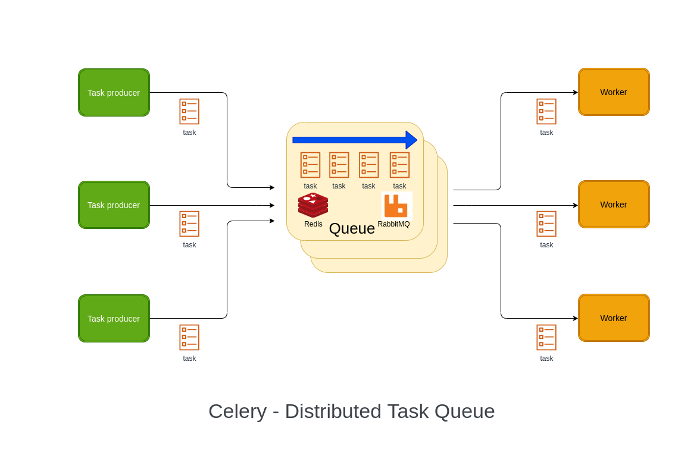

# DjangoPaws

DjangoPaws is an open-source project that allows users to download a random dog 🐶 image using a link that is updated every time the image is refreshed.

## Detailed description of the repository

DjangoPaws 🐾 is a web application developed using Python 🐍 (Django) that allows users to download random dog 🐶 images from a specified link. The application is designed to refresh the link each time the user accesses it, thereby providing a new, random dog 🐕 image every time. The application uses Celery 🌿, which is a task queue that enables the application to perform asynchronous tasks such as downloading the images in the background. Redis 🚀 is also used as a message broker to manage the tasks.

The code is organized into three main components: the web application 🌐, the task scheduler 📆, and the message broker 📨. The web application is built using Django, a high-level Python web framework that facilitates rapid development and clean, pragmatic design. The task scheduler is built using Celery 🌿, which enables the application to manage tasks such as downloading the images in the background. Finally, the message broker is built using Redis 🚀, which acts as a message broker to manage the tasks between the web application and the task scheduler.

### Technologies💻 and Libraries📚

- **[Python](https://docs.python.org/3/)**

- **[Django](https://docs.djangoproject.com/en/3.2/)**

- **[HTML](https://developer.mozilla.org/en-US/docs/Web/HTML)**

- **[Celery](https://docs.celeryq.dev/en/stable/)**

- **[Redis](https://redis.io/)**

#### Commands to launch the project using Docker

Open a terminal window and navigate to the webapp directory of the DjangoPaws project, `cd webapp`

Activate the virtual environment by running the following command:

source `venv/scripts/activate` (for Windows)
source `venv/bin/activate` (for Linux/Mac)

Navigate to the project directory by running the following command:
`cd ..`

Run the following command to launch the project using Docker:
`docker-compose up --build`

**❗️Note:** The above commands assume that Docker and Docker Compose are installed on your system. If they are not installed, please refer to the official Docker documentation 📚 to install them.

#### Celery in general

#### Demo project
